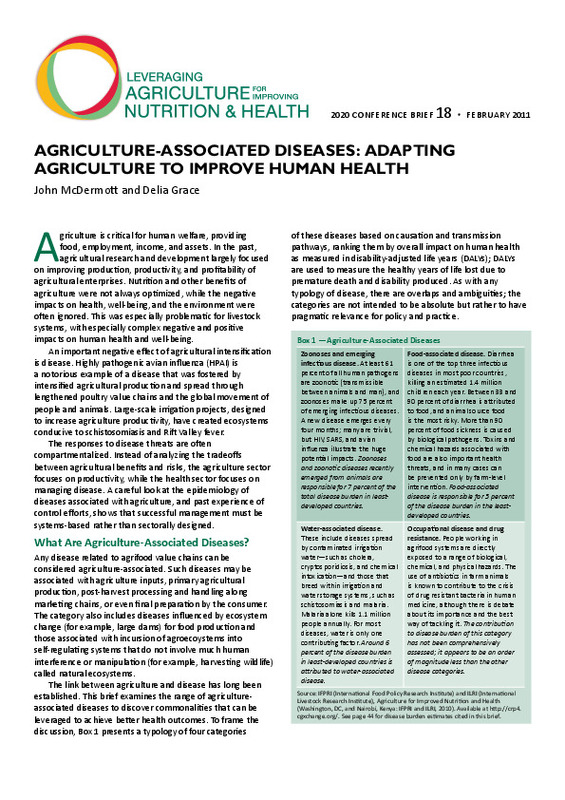

# Improving DSpace PDF Thumbnails
Based on my comparative analysis of JPEG, WebP, and AVIF with a sample size of thirty-five PDFs, I found that WebP and AVIF require an average of 33% and 46% less bits than JPEG, respectively, to achieve a [ssimulacra2](https://github.com/cloudinary/ssimulacra2) score of 80. A score of 80 falls between the "high quality" and "very high quality" brackets on ssimulacra2's scoring scale.

Given that [WebP is widely supported in web browsers](https://caniuse.com/webp) I propose switching DSpace's default PDF thumbnail format to WebP. Furthermore, I propose re-working the ImageMagick PDF thumbnail filter to not perform a double lossy conversion from PDF to JPEG to JPEG.

## Example
Comparison of a PDF thumbnail for an item from the CGSpace repository in JPEG and WebP formats.

  
  
  
JPEG Q92 (left) and WebP Q86 (right). The WebP file is 42% smaller.

See more in-depth discussion and comparisons here: https://alanorth.github.io/improved-dspace-thumbnails/evaluating-jpeg-webp-avif.html

## Merged in DSpace 7.5/7.6
DSpace can be [configured](https://wiki.lyrasis.org/display/DSDOC7x/Mediafilters+for+Transforming+DSpace+Content) to use ImageMagick to generate thumbnails for PDF bitstreams. Out of the box the quality of these thumbnails is underwhelming because the resolution is low and the image is often blurry. The quality can be improved by using a "supersampling" technique and by preferring the PDF `CropBox` over the `MediaBox` where possible. These two minor changes produce an image that more accurately resembles what the user would see if they opened the PDF on a screen, which is especially noticeable if the PDF contains text, gradients, or curved lines.

I propose adding the `-density 144` and `-define pdf:use-cropbox=true` parameters to the DSpace ImageMagick PDF thumbnail operation in DSpace 6.x and 7.x.

### Example
A comparison of the default DSpace PDF thumbnail for an item on the CGSpace repository before and after adding the `-density 144` parameter.

  
  

See more in-depth discussion and comparisons here: https://alanorth.github.io/improved-dspace-thumbnails/

## Notes

- If we don't specify a quality ImageMagick will use 92, see: https://imagemagick.org/script/command-line-options.php#quality
  - This means that, when we do a "supersample" first followed by a thumbnail, it uses quality 92 for the first, and again for the second, which is generation loss...
- `-compress Lossless` is only for JPEG and is not recommended
  - Should use `-quality 100` instead, as "lossless" JPEG is not widely supported (needs a patched libjpeg)
  - I'm unclear about the interaction between `-quality` and `-define webp:lossless=true` for WebP...

## License

>Copyright (C) Alan Orth
>
>This program is free software: you can redistribute it and/or modify
>it under the terms of the GNU General Public License as published by
>the Free Software Foundation, either version 3 of the License, or
>(at your option) any later version.
>
>This program is distributed in the hope that it will be useful,
>but WITHOUT ANY WARRANTY; without even the implied warranty of
>MERCHANTABILITY or FITNESS FOR A PARTICULAR PURPOSE.  See the
>GNU General Public License for more details.
>
>You should have received a copy of the GNU General Public License
>along with this program.  If not, see <http://www.gnu.org/licenses/>.

This repository contains code from the [image-compare-viewer](https://github.com/kylewetton/image-compare-viewer) and [sakura](https://github.com/oxalorg/sakura) projects, both of which are licensed under the MIT license.
